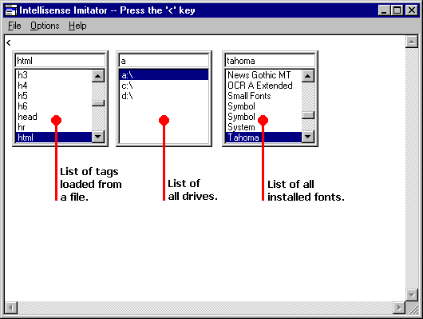



## Intellisense Imitation

### Description

Provides Intellisense imitation for your projects.

This example lets you load tags from a file to the listbox. You can also choose whether to use upper and lower case tags. Now has new features like: filling the list with drives and fonts, and an updated drawing routine that speeds it up. It now works if the screen resolution changes.
 
### More Info
 

             |
---                |---
**Submitted On**   |2000-06-29 23:08:06
**By**             |[Edward P\. Denninger III](https://github.com/Planet-Source-Code/PSCIndex/blob/master/ByAuthor/edward-p-denninger-iii.md)
**Level**          |Advanced
**User Rating**    |4.9 (44 globes from 9 users)
**Compatibility**  |VB 5\.0, VB 6\.0
**Category**       |[Custom Controls/ Forms/  Menus](https://github.com/Planet-Source-Code/PSCIndex/blob/master/ByCategory/custom-controls-forms-menus__1-4.md)
**World**          |[Visual Basic](https://github.com/Planet-Source-Code/PSCIndex/blob/master/ByWorld/visual-basic.md)
**Archive File**   |[CODE\_UPLOAD73036302000\.zip](https://github.com/Planet-Source-Code/edward-p-denninger-iii-intellisense-imitation__1-8099/archive/master.zip)

